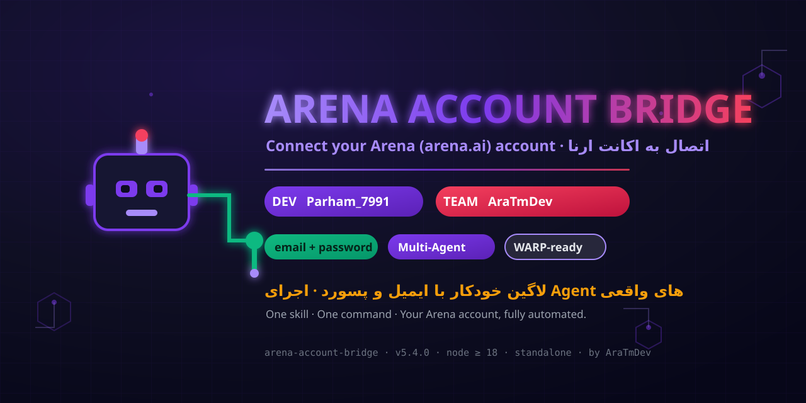

<div align="center">

# 🔌 Arena Account Bridge

**Connect your Arena (arena.ai) account — email/password login + real Agent sessions**

<br/>

<a href="https://github.com/parham7991/arena-account-bridge">
  
</a>

<br/><br/>

[](https://github.com/parham7991/arena-account-bridge/stargazers)
[](https://github.com/parham7991/arena-account-bridge/forks)
[](LICENSE)
[](package.json)
[](https://github.com/parham7991)

[](#-quick-start)
[](#-warp-proxy-recommended)

---

**English** · [فارسی](#-توضیحات-فارسی) · [License](LICENSE)

</div>

---

## ⚡ Quick Start

```bash
# One-liner (no git needed)
curl -fsSL https://raw.githubusercontent.com/parham7991/arena-account-bridge/main/bootstrap.sh | \
  ARENA_EMAIL=you@example.com ARENA_PASSWORD='your-password' bash

# or with git
git clone https://github.com/parham7991/arena-account-bridge.git
cd arena-account-bridge
bash install.sh --warp --email you@example.com --password 'your-password'
```

The installer:
1. ✅ Checks Node.js (≥ 18)
2. ✅ Installs Playwright + Chromium (+ system deps)
3. ✅ Sets up a **free Cloudflare WARP proxy** (avoids Cloudflare challenges)
4. ✅ Logs into your **own** arena.ai account (encrypted storage)
5. ✅ Starts the bridge on `http://127.0.0.1:20140`
6. ✅ Runs a **self-test** (creates a real Agent session → confirms it answers)

```
http://127.0.0.1:20140/health                → {"ok":true,...}
http://127.0.0.1:20140/v1/chat/completions   → OpenAI-compatible
```

---

## 🧠 What it does

- **Logs into arena.ai with your email + password** — real session, real cookies,
  stored encrypted (AES-256-GCM, `0600`).
- **Runs real Arena Agent Mode chats programmatically** through a local
  OpenAI-compatible API.
- **Team leader ready** — spawn several agents in parallel, each with its own
  persistent session (`x-codex-session-id`), collect outputs, merge results.
- **100% standalone** — no server, no external gateway, no third-party infra.
  Talks only to `arena.ai`.

## 🚀 Team Leader usage

```bash
# Agent 1 (analyst)
curl -X POST http://127.0.0.1:20140/v1/chat/completions \
  -H "Authorization: Bearer <ARENA_AGENT_BRIDGE_KEY>" -H "Content-Type: application/json" \
  -H "x-codex-session-id: agent-analyst-01" \
  -d '{"model":"agent","stream":false,"messages":[{"role":"user","content":"Mission card: ..."}]}'

# Agent 2 (coder) — same time, different session
curl -X POST http://127.0.0.1:20140/v1/chat/completions \
  -H "Authorization: Bearer <ARENA_AGENT_BRIDGE_KEY>" -H "Content-Type: application/json" \
  -H "x-codex-session-id: agent-coder-01" \
  -d '{"model":"agent","stream":false,"messages":[{"role":"user","content":"Mission card: ..."}]}'
```

Tools (`Bash`, `Read`, `Write`, `Edit`, `Glob`, `Grep`, `WebSearch`, `WebFetch`,
`AskUserQuestion`) are supported in OpenAI format.

## 🛡 WARP proxy (recommended)

Avoids Cloudflare "Just a moment…" challenges when automating arena.ai.

```bash
# Option A: install everything with WARP
bash install.sh --warp --email you@example.com --password '...'

# Option B: just set up WARP, then start the bridge with the proxy
bash warp.sh
export ARENA_AGENT_PROXY=socks5://127.0.0.1:40000
node src/index.mjs
```

`warp.sh` registers a **free WARP account** via Cloudflare's own API
(`bin/warp-setup.mjs`, pure Node — no Python), writes a wireproxy config, and
starts the SOCKS5 proxy on `127.0.0.1:40000`.

## 📁 Structure

```
arena-account-bridge/
├── SKILL.md            # full instructions (what agents should run)
├── install.sh          # one-shot installer (--warp, --no-login, ...)
├── bootstrap.sh        # one-line installer (no git needed)
├── warp.sh             # WARP proxy setup
├── src/                # bridge source (12 modules)
├── bin/                # login, new-agent, attach-session, verify, selftest, warp-setup
├── test/               # 33 unit tests
└── assets/             # banner.svg, hero.png
```

## 🧪 Tests

```bash
cd arena-account-bridge && node --test test/
# 33 passing
```

## 🔒 Security notes

- Password + cookies encrypted with **AES-256-GCM** (`credentials.json`, `0600`).
- Password never printed or uploaded anywhere except arena.ai's login endpoint.
- Open-source and auditable — every line is in this repo.
- Bind to `127.0.0.1`; never expose the port publicly without auth.

---

## 📖 توضیحات فارسی

### این ابزار چیه؟
**Arena Account Bridge** یک ابزار مستقل برای **اتصال به اکانت خودت در ارنا (arena.ai)** است:

- با **ایمیل و پسورد** وارد اکانت خودت میشه (کوکی واقعی، ذخیرهی رمزشده).
- **چتهای واقعی Agent Mode** رو بهصورت برنامهنویسیشده اجرا میکنه (API سازگار با OpenAI).
- برای **تیم لیدری** آمادهست: چند Agent موازی، هرکدوم با سشن مستقل
  (`x-codex-session-id`)، جمعآوری خروجیها و ادغام.
- **بدون سرور خارجی** — فقط با خود arena.ai ارتباط داره.

### نصب سریع
```bash
curl -fsSL https://raw.githubusercontent.com/parham7991/arena-account-bridge/main/bootstrap.sh | \
  ARENA_EMAIL=you@example.com ARENA_PASSWORD='your-password' bash
# یا
git clone https://github.com/parham7991/arena-account-bridge.git && cd arena-account-bridge
bash install.sh --warp --email you@example.com --password 'your-password'
```

نصبنصبکننده: Node رو چک میکنه، Playwright + Chromium نصب میکنه، **پروکسی رایگان
Cloudflare WARP** راه میندازه (جلوی چالش Cloudflare رو میگیره)، با اکانت خودت
لاگین میکنه، پل رو روی `127.0.0.1:20140` بالا میاره و **سلفتست** میگیره.

### استفادهی تیم لیدری
```bash
curl -X POST http://127.0.0.1:20140/v1/chat/completions \
  -H "Authorization: Bearer <KEY>" -H "Content-Type: application/json" \
  -H "x-codex-session-id: agent-analyst-01" \
  -d '{"model":"agent","messages":[{"role":"user","content":"کارت مأموریت: ..."}]}'
```

### نکات امنیتی
- پسورد و کوکی با **AES-256-GCM** رمز میشن (`credentials.json`، دسترسی `0600`).
- پسورد هیچجا جز endpoint ورودِ خودِ arena.ai ارسال نمیشه.
- کل سورس متنباز و قابل ممیزی است.

---

<div align="center">

**Made with 💜 by [Parham_7991](https://github.com/parham7991) · [AraTmDev](https://github.com/parham7991)**

⭐ Star this repo if you find it useful · 🍴 Fork it to make it yours

</div>
